### 처리된 요구사항 목록

| 난이도 | 구현기능                         | 세부                                                                                                                       | 작성여부(O/X) |
| :----: | -------------------------------- | -------------------------------------------------------------------------------------------------------------------------- | :-----------: |
|  기본  | 메인 페이지 및 메뉴 구성         |                                                                                                                            |       O       |
|  기본  | 관광지 정보 조회                 | data.go.kr 사용 X                                                                                                          |       O       |
|  기본  | 관광지 정보 조회 - 블로그 검색   | Kakao 검색 사용 Server를 통해 Kakao Rest API 요청을 Proxy로 처리 Service Key 노출 제한 (Spring WebClient 사용) |       O       |
|  기본  | 회원관리 페이지                  | 회원정보 등록, 수정, 삭제, 조회 화면                                                                                       |       O       |
|  기본  | 로그인/로그아웃 페이지           |                                                                                                                            |       O       |
|  추가  | 사이트맵/전체적인 메뉴 구성 화면 |                                                                                                                            |       O       |
|  심화  | 게시판 페이지                    | 글등록, 목록, 조회, 수정 화면                                                                                              |       O       |
|  심화  | 페이징                           | 게시판, 관광지 조회                                                                                                        |       O       |

- Servlet 기반 프로젝트를 Spring Boot 기반으로 Migration (백엔드 단 재구축)
- 향후 Vue.js를 사용한 프로젝트에서 사용할 수 있도록 Rest API 구축

### 실행화면 캡쳐

TODO: 요구사항 목록에서 완료 처리된 사항의 캡쳐 이미지를 등록하세요.

DB 구축 : select한 결과를 캡쳐해 주세요

구현 기능: 메인 페이지 및 메뉴 구성
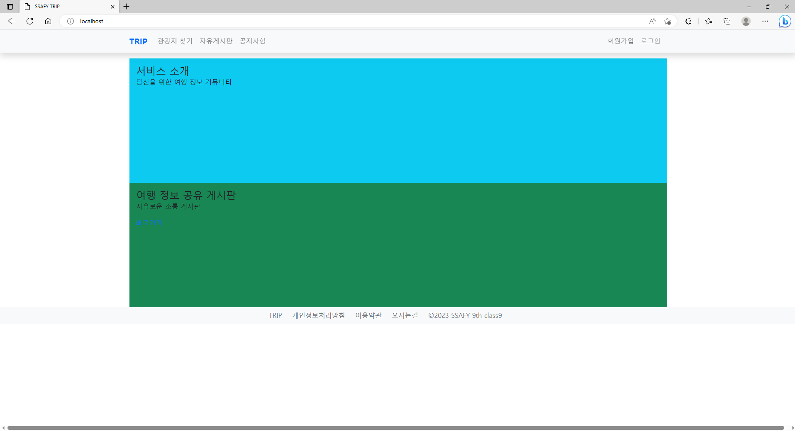

구현 기능: 관광지 정보 조회
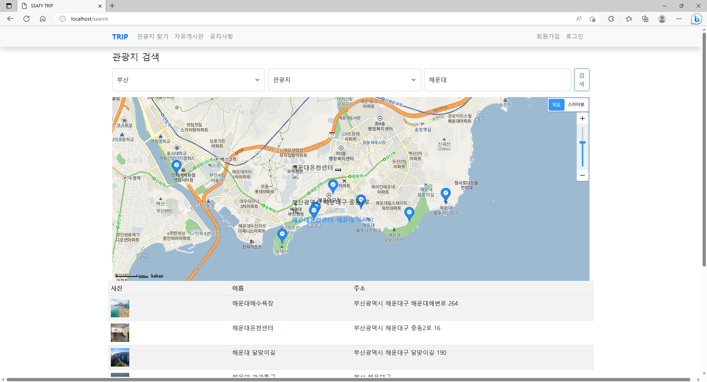

구현 기능: 관광지 정보 조회 (data.go.kr 사용 X)
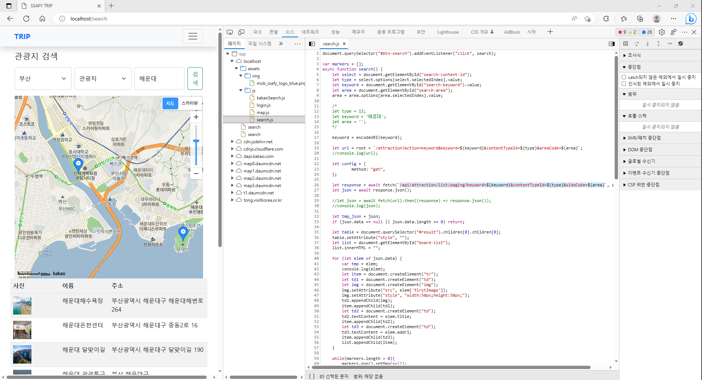

구현 기능: 관광지 정보 조회 - 블로그 검색 (Spring WebClient -> Proxy)
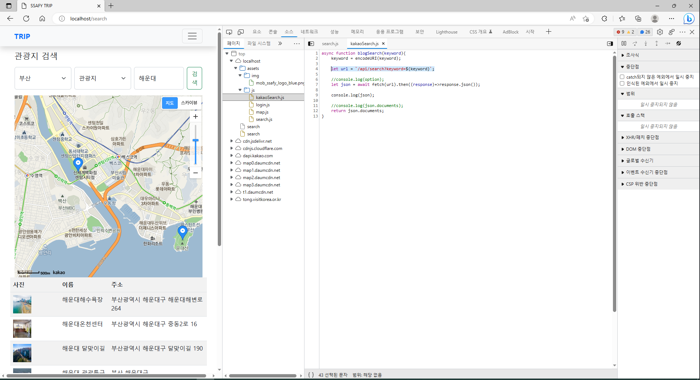

구현 기능: 로그인 (REST API)
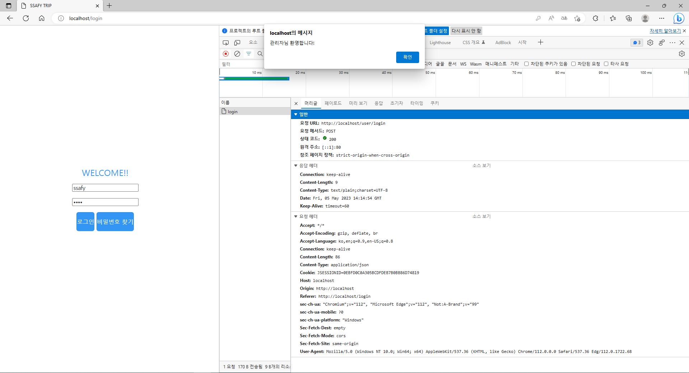

구현 기능: 로그인 (REST API)
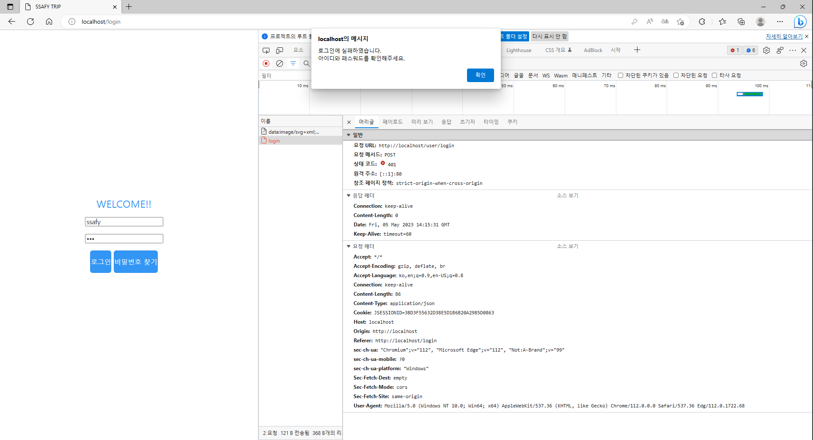

구현 기능: 회원 관리 페이지 - 수정
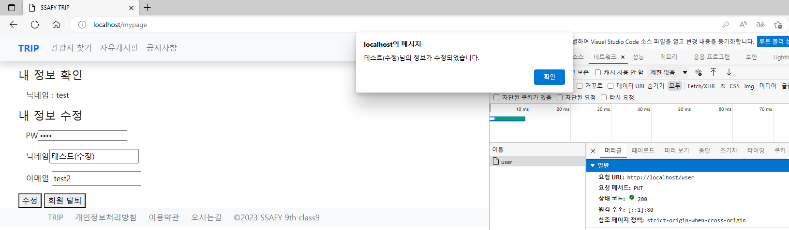

구현 기능: 회원 관리 페이지 - 수정 결과
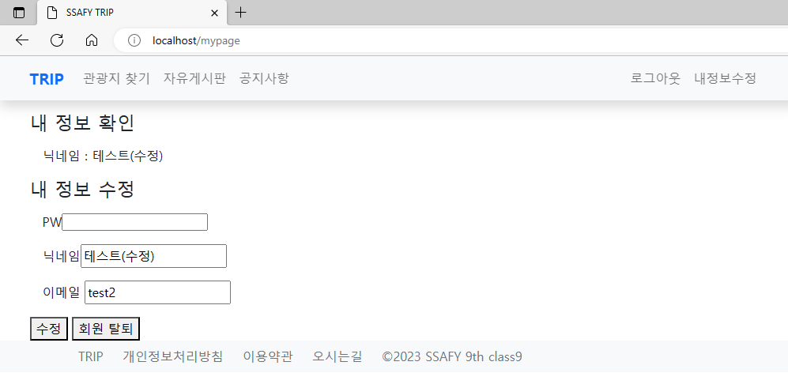

구현 기능: 게시판 - 권한 (공지사항 -> 관리자만 글 등록 가능)
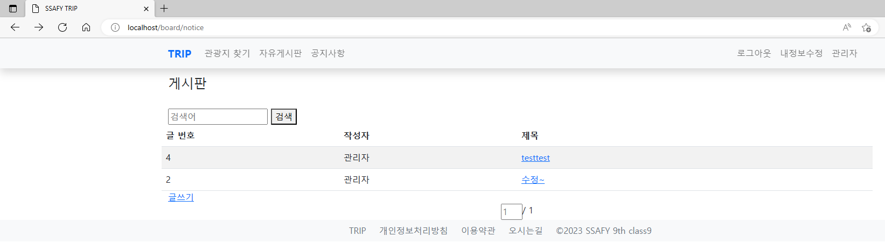

구현 기능: 게시판 - 권한 (공지사항 -> 관리자 외 조회만 가능)
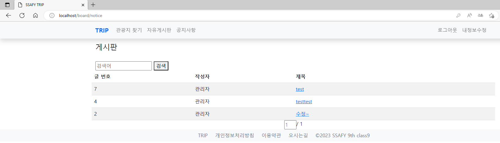

구현 기능: 게시판 - 등록 (REST API)
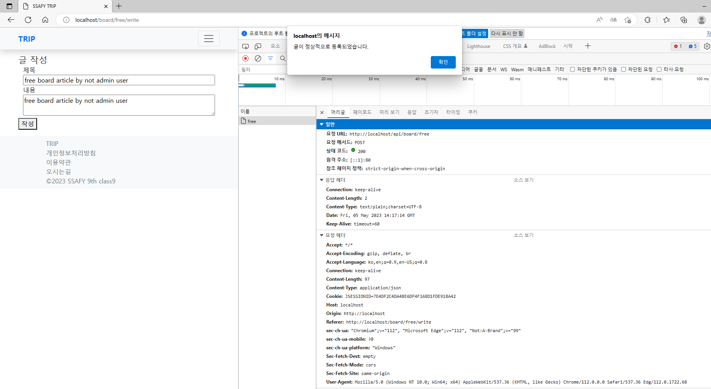

구현 기능: 게시판 - 수정 (REST API)
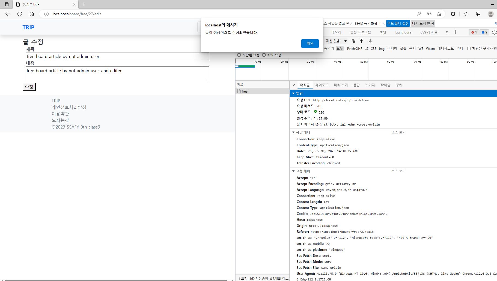

구현 기능: 게시판 - 게시글 등록자 외 관리자도 수정 가능
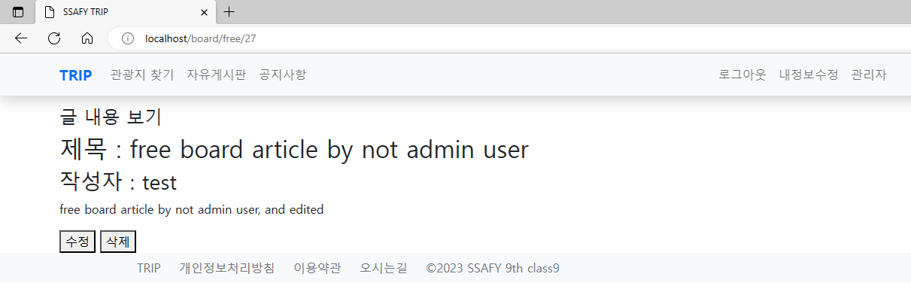

구현 기능: 게시판 - 게시글 등록자 외 관리자도 수정 가능
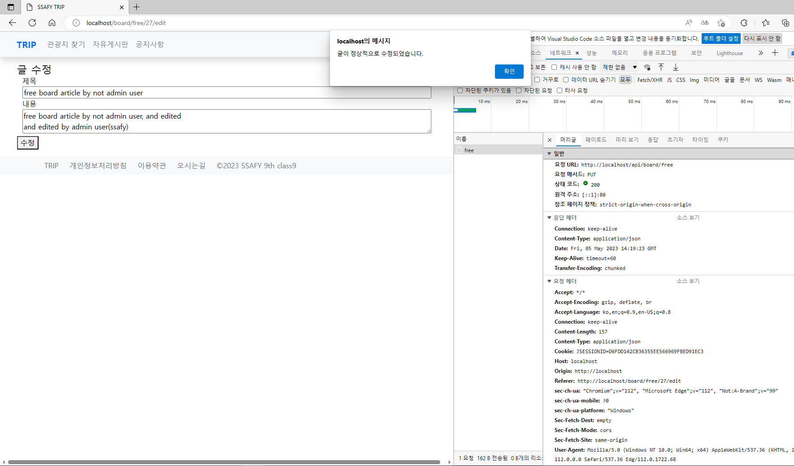

구현 기능: 게시판 - 게시글 등록자 외 관리자도 수정 결과
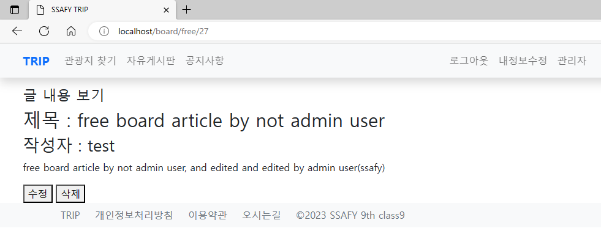

구현 기능: 게시판 권한 확인, 로그인 한 유저의 권한을 벗어나는 행위를 강제로 시도할 경우 백엔드 단에서 차단
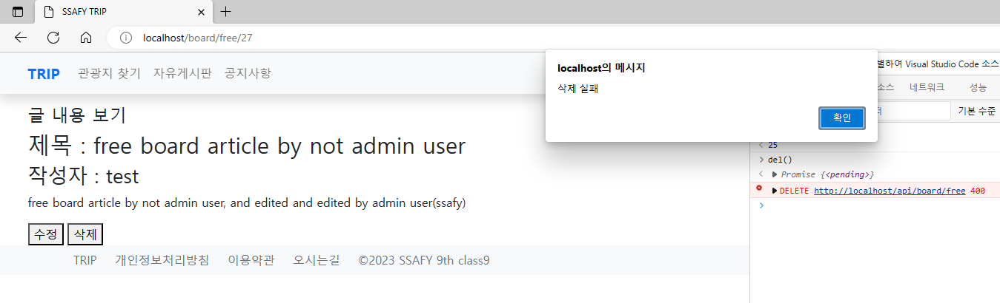

구현 기능: 페이징 (REST API)
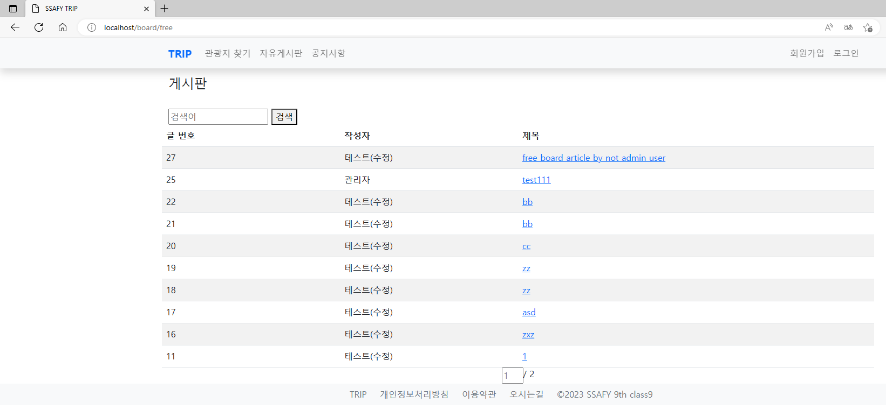

구현 기능: 페이징 (REST API)
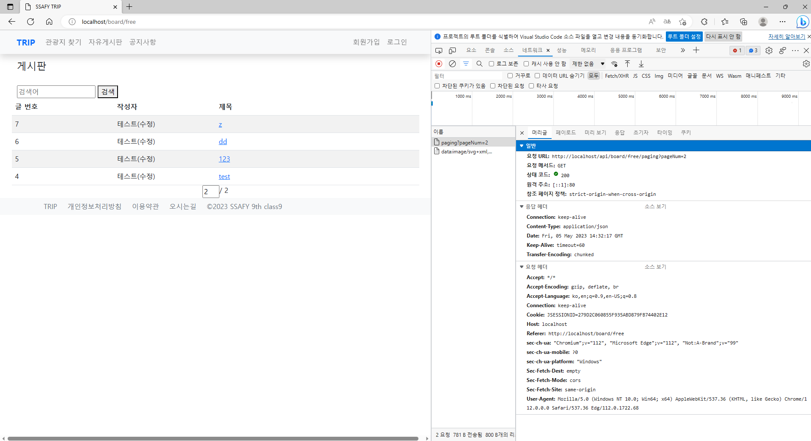
